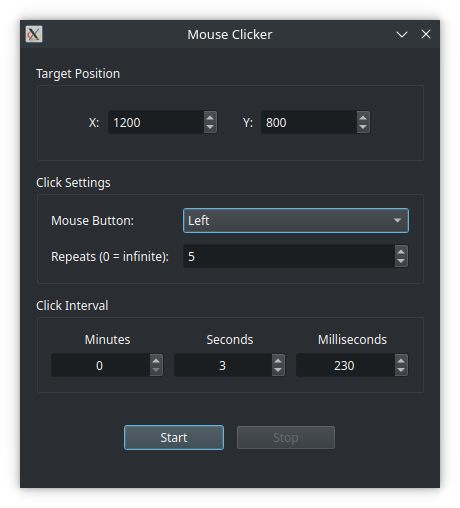

# Mouse-clicker

A simple mouse-clicker application for Linux using Qt6 and X11.



## Features

* Set the number of click repeats
* Set the interval between clicks
* Set the X/Y coordinates where clicks should occur
* Choose the mouse button:

  * Left
  * Middle
  * Right

## Requirements

* Qt6
* X11
* Linux

## Build

After installing the required dependencies, run:

```bash
cmake -B build/ -S .
cmake --build build/
```

The built application will be available in the `build/` directory.

```bash
./build/mouse-clicker-app
```